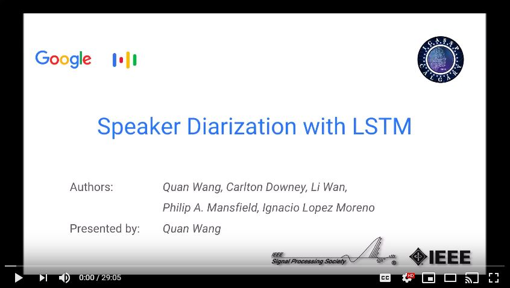

# Spectral Clustering [](https://travis-ci.org/wq2012/SpectralCluster) [](https://pypi.python.org/pypi/spectralcluster) [](https://pypi.org/project/spectralcluster) [](https://codecov.io/gh/wq2012/SpectralCluster) [](https://wq2012.github.io/SpectralCluster)

## Overview

This is a Python re-implementation of the spectral clustering algorithm in the
paper [Speaker Diarization with LSTM](https://google.github.io/speaker-id/publications/LstmDiarization/).


## Disclaimer

**This is not the original implementation used by the paper.**

Specifically, in this implementation, we use the K-Means from
[scikit-learn](https://scikit-learn.org/stable/modules/generated/sklearn.cluster.KMeans.html),
which does NOT support customized distance measure like cosine distance.

## Dependencies

* numpy
* scipy
* scikit-learn

## Installation

Install the [package](https://pypi.org/project/spectralcluster/) by:

```bash
pip3 install spectralcluster
```

or

```bash
python3 -m pip install spectralcluster
```

## Tutorial

Simply use the `predict()` method of class `SpectralClusterer` to perform
spectral clustering:

```python
from spectralcluster import SpectralClusterer

clusterer = SpectralClusterer(
    min_clusters=2,
    max_clusters=100,
    p_percentile=0.95,
    gaussian_blur_sigma=1)

labels = clusterer.predict(X)
```

The input `X` is a numpy array of shape `(n_samples, n_features)`,
and the returned `labels` is a numpy array of shape `(n_samples,)`.

For the complete list of parameters of the clusterer, see
`spectralcluster/spectral_clusterer.py`.

[](https://youtu.be/pjxGPZQeeO4)

## Citations

Our paper is cited as:

```
@inproceedings{wang2018speaker,
  title={Speaker diarization with lstm},
  author={Wang, Quan and Downey, Carlton and Wan, Li and Mansfield, Philip Andrew and Moreno, Ignacio Lopz},
  booktitle={2018 IEEE International Conference on Acoustics, Speech and Signal Processing (ICASSP)},
  pages={5239--5243},
  year={2018},
  organization={IEEE}
}
```

## Misc

Our new speaker diarization systems are now fully supervised, powered by
[uis-rnn](https://github.com/google/uis-rnn).
Check this [Google AI Blog](https://ai.googleblog.com/2018/11/accurate-online-speaker-diarization.html).

To learn more about speaker diarization, here is a curated list of resources:
[awesome-diarization](https://github.com/wq2012/awesome-diarization).
